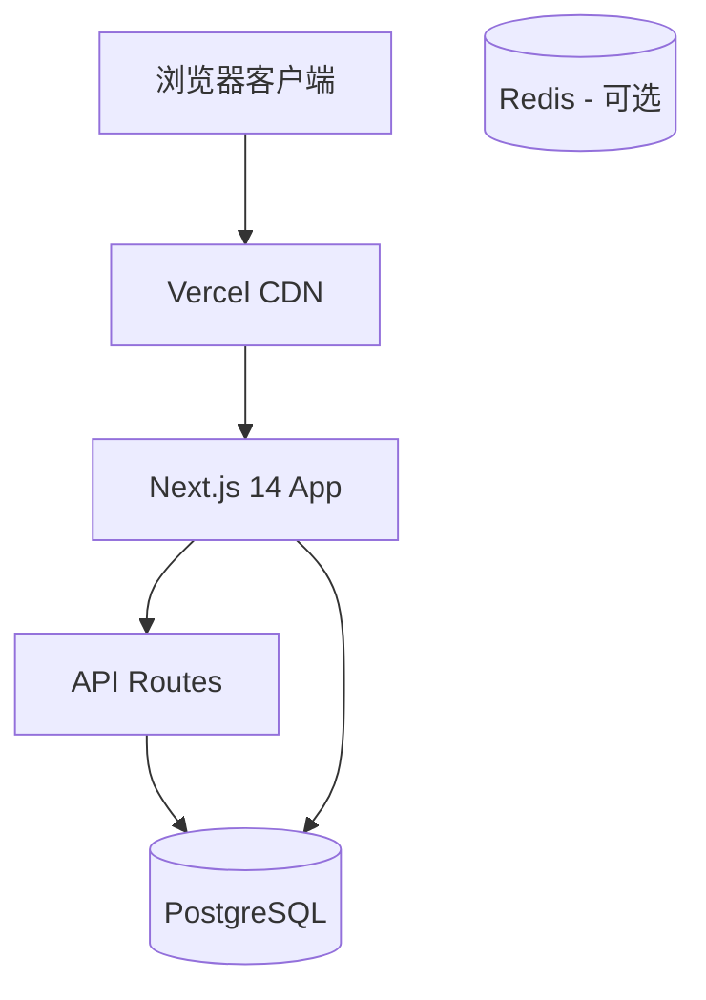

# BMAD-First 交互模式演示

**完整展示：如何使用BMAD代理协作开发个人博客**

---

## 🎯 概述

你现在拥有一个强大的 **BMAD-First 交互模式**！

当你说"创建一个XXX项目"时，系统会：
1. ✅ 自动采用BMAD代理工作流
2. ✅ 代理根据需要调用10个MCP和17个Skills
3. ✅ 从需求分析到代码实现全程指导
4. ✅ 自然的代理流转和专业分工

---

## 📖 完整演示：创建个人技术博客

### 🎬 **场景开始**

```
用户: "我要创建一个个人技术博客"
```

---

### 🎭 **第1阶段：Analyst (Mary 📊) - 需求分析**

```markdown
🎭 我现在以 **Analyst (Mary)** 的身份为你服务！

作为BMAD的业务分析师，我会进行深入的需求分析。
让我先调用一些工具来辅助...

【🔧 调用 Context7】查询现代博客平台技术栈
📚 获取: Next.js, Ghost, WordPress, Medium 对比

【🔧 调用 Sequential Thinking】分解个人博客的核心价值
🧠 分析: 内容展示 + SEO + 社交互动 + 个人品牌

【🔧 调用 Ref】搜索技术博客成功案例
🔍 发现: Dan Abramov, Kent C. Dodds, Josh Comeau

基于初步分析，我有几个关键问题：

📊 **市场定位**
1. 你的博客主要写什么内容？（前端/后端/全栈/AI/其他）
2. 目标读者是谁？（初学者/中级/高级开发者）

📊 **功能需求**
3. 核心功能：文章发布 + ？（评论/搜索/订阅/分类/标签）
4. 技术展示：是否需要代码高亮、在线demo、交互式示例？

📊 **技术偏好**
5. 你熟悉的技术栈？（React/Vue/纯静态）
6. 部署偏好？（自己部署/托管服务）
7. 预算限制？（免费优先/可接受付费）

📊 **时间规划**
8. 期望上线时间？（1周快速上线/2-4周完善功能）
9. 是否愿意使用现成主题还是完全自定义？

请回答这些问题，我会创建详细的项目简报！
```

---

### 💬 **用户回答**

```
用户: 
"1. 前端和全栈技术文章
2. 中高级开发者
3. 需要代码高亮、Markdown、评论、搜索、RSS订阅
4. 需要代码高亮，最好支持交互式demo
5. 熟悉React和Next.js
6. 想自己部署到Railway
7. 免费优先，但可接受Railway少量费用
8. 2周内MVP上线
9. 完全自定义，打造个人品牌"
```

---

### 🎭 **Analyst 继续分析**

```markdown
🎭 Analyst (Mary):

完美！让我深入分析并创建项目简报。

【🔧 调用 Context7】查询Next.js博客最佳实践
📚 学习: Next.js 14 App Router, MDX, contentlayer

【🔧 调用 Replicate MCP】生成博客设计灵感
🎨 生成: 极简专业风格的博客视觉参考

【🔧 调用 Sequential Thinking】分析竞品差异化
💡 发现机会:
- Medium: 托管但不可控 → 我们提供完全自定义
- Ghost: 付费 → 我们免费部署
- Hashnode: 功能固定 → 我们可扩展

【📄 创建项目简报】使用 bmad-integration 的模板

# 个人技术博客平台 - 项目简报

## 执行摘要
构建一个现代化的个人技术博客，专注于前端和全栈内容，
面向中高级开发者，完全自主控制，2周内上线MVP。

## 问题陈述
现有博客平台存在以下问题：
- Medium/知乎: 不可控，平台规则变化影响大
- Ghost: $9/月起步，不适合个人预算
- WordPress: 过于臃肿，安全维护成本高
- 自建CMS: 开发周期长，功能简陋

需要一个**专业、可控、成本低、功能强**的技术博客方案。

## 目标用户
### 主要读者
- **谁**: 中高级前端/全栈开发者
- **需求**: 深度技术文章、实用代码示例、前沿技术探索
- **痛点**: 难找高质量中文技术内容

### 次要读者
- 搜索引擎用户（SEO流量）
- RSS订阅者（技术爱好者）

## 成功指标
1. **MVP上线**: 2周内部署到production
2. **性能**: 页面加载 < 2s, Lighthouse > 90分
3. **SEO**: 首页被Google索引
4. **用户互动**: 支持评论，有基础反垃圾

## MVP功能范围

### ✅ 必须有（MVP）
1. Markdown文章编写和发布
2. 代码语法高亮（30+语言）
3. 文章分类和标签系统
4. 全文搜索（标题+内容+标签）
5. 评论系统（基础反垃圾）
6. RSS feed
7. 响应式设计（移动+桌面）
8. 深色模式

### 🔜 未来版本
- v1.1: 邮件订阅、社交分享计数
- v1.2: 交互式代码playground
- v2.0: 文章系列、多作者支持

### ❌ 明确排除
- 多语言支持（只中文+英文）
- 付费会员系统
- 视频托管

## 技术约束
- **前端**: Next.js 14 (App Router) + React
- **部署**: Railway（PostgreSQL + Next.js）
- **预算**: 尽量使用免费层，可接受Railway $5/月
- **时间线**: 2周MVP，4周完善版

## 竞品分析
| 平台 | 优势 | 劣势 | 我们的方案 |
|------|------|------|-----------|
| Medium | 流量大 | 不可控，限制多 | 完全自主 |
| Ghost | 专业 | $9/月 | Railway $5/月 |
| Hashnode | 免费 | 功能固定 | 可自定义 |
| 自建WP | 成熟 | 维护成本高 | 现代化技术栈 |

**我们的差异化**: 
专业技术博客 + 完全自主 + 现代技术栈 + 低成本 + 可扩展

## 初步技术方案
- **内容管理**: MDX文件或数据库混合
- **评论**: 集成Giscus（GitHub Discussions）或自建
- **搜索**: PostgreSQL全文搜索或Algolia
- **分析**: PostHog追踪阅读数据

【🔧 调用 PostHog MCP】了解博客分析最佳实践

## 风险与缓解
| 风险 | 影响 | 缓解措施 |
|------|------|---------|
| 2周时间紧张 | 高 | 使用Next.js模板，专注MVP功能 |
| Railway成本 | 中 | 优化数据库查询，控制在免费层 |
| SEO冷启动 | 中 | 高质量内容+技术SEO优化 |

---

✅ **项目简报已完成！**

📂 建议保存为: `docs/project-brief.md`

🎯 **下一步**: 交接给 PM (John) 创建详细PRD

【流转提示】
项目简报已完成！交接给 PM (John) 创建PRD。
```

---

### 🎭 **第2阶段：PM (John 📋) - 创建PRD**

```markdown
🎭 我现在切换到 **PM (John)** 身份！

收到Analyst的项目简报，作为产品经理，我会创建详细的PRD。

【🔧 调用 Context7】查询Next.js博客架构
📚 学习: Next.js官方博客案例、MDX集成方案

【🔧 调用 bmad-integration】加载PRD模板
📋 使用: references/document-templates.md 中的PRD Template

【🔧 调用 Postman MCP】研究博客API设计
🔍 参考: Ghost API, WordPress REST API

【📄 创建PRD】

# 技术博客平台 - PRD v1.0

## 更改日志
| 日期 | 版本 | 描述 | 作者 |
|------|------|------|------|
| 2025-10-26 | 1.0 | 初始PRD | PM (John) |

## 目标和背景

### 目标
- 在2周内上线专业技术博客MVP
- 提供卓越的代码阅读体验（语法高亮、响应式）
- 建立个人技术品牌和影响力
- 实现完全自主控制的内容平台

### 背景
基于项目简报，我们需要构建一个面向中高级开发者的技术博客...

## 功能需求

### 功能需求（Functional）
1. **FR1**: 博主可使用Markdown编写文章，支持frontmatter元数据
2. **FR2**: 支持30+编程语言的语法高亮，代码块可复制
3. **FR3**: 文章支持分类（Frontend/Backend/Fullstack等）和多标签
4. **FR4**: 全文搜索引擎，搜索文章标题、内容、标签
5. **FR5**: 读者可以对文章评论，支持Markdown格式
6. **FR6**: 自动生成RSS/Atom feed供订阅
7. **FR7**: 响应式设计，移动端和桌面端都有良好体验
8. **FR8**: 深色/浅色主题切换

【🔧 调用 shadcn-ui MCP】查看主题切换组件

### 非功能需求（Non-Functional）
1. **NFR1**: 性能 - 首页加载时间 < 2s, Lighthouse分数 > 90
2. **NFR2**: SEO - 所有页面支持SSG，有正确的meta标签
3. **NFR3**: 安全 - 评论需XSS防护，SQL注入防护
4. **NFR4**: 可扩展性 - 支持100篇文章，日访问1000次
5. **NFR5**: 成本 - Railway部署成本 < $10/月

【🔧 调用 Semgrep MCP】了解常见安全漏洞

## UI/UX设计目标

### 整体视觉
- 极简专业风格
- 强调内容可读性
- 代码块突出显示
- 清晰的视觉层次

【🔧 调用 theme-factory skill】获取配色灵感
🎨 推荐配色: Modern Minimalist 或 Tech Innovation

### 核心页面
1. **首页** - 文章列表，分类导航，搜索框
2. **文章详情** - 内容+代码+评论+相关文章
3. **分类页** - 按分类浏览文章
4. **标签页** - 按标签聚合
5. **关于页** - 个人介绍
6. **管理后台** - 写作/编辑/发布（简单CMS）

## User Stories（按Epic组织）

### Epic 1: 内容管理系统
**目标**: 博主能够轻松创建和管理文章

- **US1.1**: 作为博主，我要用Markdown编辑器写文章，以便快速创作
  - **Priority**: High
  - **Acceptance Criteria**:
    1. 支持完整Markdown语法
    2. 实时预览
    3. 草稿自动保存
    
- **US1.2**: 作为博主，我要为文章添加分类和标签，以便组织内容
  - **Priority**: High
  - **Acceptance Criteria**:
    1. 可选择或创建分类
    2. 可添加多个标签
    3. 支持中英文

- **US1.3**: 作为博主，我要发布文章到production，以便读者访问
  - **Priority**: High
  - **Acceptance Criteria**:
    1. 一键发布
    2. SEO元数据自动生成
    3. 发布后可编辑

### Epic 2: 阅读体验
**目标**: 读者获得卓越的阅读体验

- **US2.1**: 作为读者，我要看到清晰的代码高亮，以便理解代码示例
  - **Priority**: High
  - **Acceptance Criteria**:
    1. 30+语言支持
    2. 行号显示
    3. 代码复制按钮
    
【🔧 调用 Context7】查询 Prism.js vs highlight.js
📚 推荐: Prism.js（体积小，支持React）

- **US2.2**: 作为读者，我要搜索文章，以便找到感兴趣的内容
  - **Priority**: Medium
  - **Acceptance Criteria**:
    1. 搜索标题、内容、标签
    2. 即时搜索建议
    3. 搜索结果高亮

- **US2.3**: 作为读者，我要评论文章，以便与作者交流
  - **Priority**: Medium
  - **Acceptance Criteria**:
    1. 支持Markdown评论
    2. 基础反垃圾（Akismet或reCAPTCHA）
    3. 评论可回复（嵌套）

### Epic 3: 个人品牌
**目标**: 建立专业的技术博客形象

- **US3.1**: 作为读者，我要看到专业的博客设计，以便信任内容质量
- **US3.2**: 作为读者，我要RSS订阅，以便获取更新通知
- **US3.3**: 作为博主，我要追踪文章阅读数据，以便了解读者兴趣

【🔧 调用 PostHog MCP】配置阅读追踪事件
📈 设置: 文章浏览、阅读时长、代码复制次数

---

✅ **PRD创建完成！**

📂 建议保存为: `docs/prd.md`

🎯 **下一步**: 交接给 Architect (Sam) 设计系统架构

【流转提示】
PRD已完成！交接给 Architect (Sam) 设计架构。
```

---

### 🎭 **第3阶段：Architect (Sam 🏗️) - 技术架构**

```markdown
🎭 我现在切换到 **Architect (Sam)** 身份！

收到PRD！作为系统架构师，我会设计完整的技术架构。

【🔧 调用 fullstack-workflow skill】获取Next.js架构模板
📐 加载: Full-stack架构最佳实践

【🔧 调用 Context7】查询技术栈细节
📚 查询: Next.js 14, Prisma, shadcn/ui, Prism.js

【📄 创建架构文档】

# 技术博客平台 - 系统架构 v1.0

## 系统概览

【🔧 调用 fullstack-workflow】生成架构图



## 技术栈选择

### 前端技术
- **框架**: Next.js 14 (App Router) - SSG性能优化
- **UI库**: shadcn/ui + Tailwind CSS - 现代化组件
- **语法高亮**: Prism.js + prism-react-renderer
- **Markdown**: MDX + remark/rehype 生态
- **状态管理**: React Context（轻量级项目）
- **表单**: React Hook Form

【🔧 调用 shadcn-ui MCP】列出可用组件
📦 计划使用: Button, Card, Input, Textarea, Tabs, Dialog

### 后端技术
- **Runtime**: Node.js 20
- **API**: Next.js API Routes（同项目部署）
- **ORM**: Prisma（类型安全）
- **认证**: NextAuth.js（仅管理后台）
- **搜索**: PostgreSQL 全文搜索（tsvector）

### 数据库Schema

【🔧 调用 Context7】查询Prisma schema最佳实践

```prisma
model Post {
  id          String    @id @default(cuid())
  title       String
  slug        String    @unique
  content     String    @db.Text
  excerpt     String?
  coverImage  String?
  published   Boolean   @default(false)
  publishedAt DateTime?
  createdAt   DateTime  @default(now())
  updatedAt   DateTime  @updatedAt
  
  categoryId  String
  category    Category  @relation(...)
  tags        Tag[]     @relation(...)
  comments    Comment[]
  
  @@index([slug])
  @@index([published, publishedAt])
}

model Category {
  id    String @id @default(cuid())
  name  String @unique
  slug  String @unique
  posts Post[]
}

model Tag {
  id    String @id @default(cuid())
  name  String @unique
  slug  String @unique
  posts Post[]
}

model Comment {
  id        String   @id @default(cuid())
  content   String   @db.Text
  author    String
  email     String
  postId    String
  post      Post     @relation(...)
  createdAt DateTime @default(now())
  approved  Boolean  @default(false)
}
```

### 部署架构

【🔧 调用 Railway MCP】检查部署需求
🚂 配置: PostgreSQL addon + Next.js service

【🔧 调用 fullstack-workflow】获取Docker模板
🐳 使用: assets/docker-templates/react-app/

```
Railway Deployment:
├── PostgreSQL (Database)
│   └── Persistent volume
└── Next.js App (Frontend + API)
    ├── Build: npm run build
    └── Start: npm start
```

### 安全架构

【🔧 调用 Semgrep MCP】安全检查清单
🔒 计划:
- XSS防护（DOMPurify处理评论）
- SQL注入防护（Prisma参数化查询）
- Rate limiting（评论防刷）
- CSRF保护（NextAuth内置）

## Epic分解架构

### Epic 1: 内容管理系统
**技术方案**:
- MDX文件 + 数据库混合模式
- 管理界面使用 shadcn/ui 组件
- 图片上传到Cloudinary（免费层）

**文件结构**:
```
src/app/
├── admin/
│   ├── write/page.tsx         # Markdown编辑器
│   └── posts/page.tsx         # 文章管理列表
├── api/
│   └── posts/route.ts         # CRUD API
└── (blog)/
    └── [slug]/page.tsx        # 文章详情页
```

### Epic 2: 阅读体验
**技术方案**:
- SSG生成静态页面（性能优化）
- Prism.js代码高亮（build时处理）
- PostgreSQL全文搜索（性能够用）

### Epic 3: 个人品牌
**技术方案**:
- Giscus评论（利用GitHub Discussions）
- RSS feed自动生成
- PostHog追踪（阅读量、热门文章）

【🔧 调用 PostHog MCP】创建事件定义
📊 事件: post_view, code_copy, search_query, comment_submit

---

✅ **架构文档已完成！**

📂 建议保存为: `docs/architecture.md`

🎯 **下一步**: 交接给 PO (Taylor) 验证文档一致性

【流转提示】
架构已完成！交接给 PO (Taylor) 验证文档。
```

---

### 🎭 **第4阶段：PO (Taylor ✅) - 验证和分片**

```markdown
🎭 我现在切换到 **PO (Taylor)** 身份！

收到所有规划文档！作为Product Owner，我会进行一致性验证。

【🔧 调用 bmad-integration】执行验证清单
✅ PRD目标与项目简报一致
✅ 架构技术栈符合PRD的NFR要求
✅ 每个Epic都有对应的技术实现方案
✅ 时间线可行（2周MVP确实可达成）
✅ 所有功能需求都有架构支持

【🔧 调用 Sequential Thinking】分析依赖关系
💡 发现: Epic 1必须先完成（内容管理），Epic 2依赖Epic 1

【📂 文档分片】

【🔧 调用 bmad-integration】运行分片脚本
```

```bash
python skills/bmad-integration/bmad-integration/scripts/shard_documents.py \
  docs/prd.md \
  docs/architecture.md \
  docs
```

```
📊 Found 3 epics in PRD
✅ Created epic-1-content-management/
✅ Created epic-2-reading-experience/
✅ Created epic-3-personal-brand/

🏗️ Found 3 epic-specific architecture sections
✅ Created epic-1-content-management/architecture.md
✅ Created epic-2-reading-experience/architecture.md
✅ Created epic-3-personal-brand/architecture.md

📂 文档分片结果:
docs/
├── prd.md
├── architecture.md
├── prd/
│   ├── epic-1-content-management/
│   │   ├── requirements.md      # FR1, FR2 相关
│   │   └── stories.md           # US1.1, US1.2, US1.3
│   ├── epic-2-reading-experience/
│   │   ├── requirements.md      # FR3, FR4, FR5
│   │   └── stories.md           # US2.1, US2.2, US2.3
│   └── epic-3-personal-brand/
│       ├── requirements.md      # FR6, FR7, FR8
│       └── stories.md           # US3.1, US3.2, US3.3
└── architecture/
    ├── epic-1-content-management/
    │   └── architecture.md      # MDX+数据库方案
    ├── epic-2-reading-experience/
    │   └── architecture.md      # SSG+搜索方案
    └── epic-3-personal-brand/
        └── architecture.md      # Giscus+RSS方案
```

---

✅ **文档验证和分片完成！**

🎯 **下一步**: 交接给 SM (Casey) 创建第一个开发故事

【流转提示】
文档验证和分片完成！交接给 SM (Casey) 创建故事。
```

---

### 🎭 **第5阶段：SM (Casey 📝) - 创建开发故事**

```markdown
🎭 我现在切换到 **SM (Casey)** 身份！

作为Scrum Master，我会从Epic 1开始创建详细的开发故事。

【📖 读取分片文档】
- docs/prd/epic-1-content-management/requirements.md
- docs/prd/epic-1-content-management/stories.md
- docs/architecture/epic-1-content-management/architecture.md

【🔧 调用 Context7】查询Markdown编辑器库
📚 研究: SimpleMDE, react-md-editor, 自建方案

【📄 创建Story】使用bmad-integration的Story模板

# Story 001: Markdown文章编辑器

## Story元数据
- **Epic**: Epic 1 - 内容管理系统
- **Story ID**: US1.1
- **Status**: Draft
- **Priority**: High
- **预估工时**: 8小时

## 上下文（为什么需要这个Story）

### 来自PRD
博主需要一个专业的Markdown编辑器来创作技术文章，支持实时预览和草稿保存。

### User Story
**作为** 博主，
**我想要** 用Markdown编辑器写文章，
**以便** 快速创作并预览效果。

### 相关需求
- FR1: Markdown编写和发布
- NFR1: 性能良好（编辑流畅）

## 需求和验收标准

### 功能需求
1. Markdown编辑器组件（左侧编辑，右侧预览）
2. 支持完整Markdown语法 + frontmatter
3. 自动保存草稿（每30秒）
4. 工具栏（加粗、斜体、代码块、图片）

### 验收标准
- [ ] 可以输入Markdown文本
- [ ] 实时预览渲染正确
- [ ] 代码块语法高亮显示
- [ ] 草稿每30秒自动保存
- [ ] 页面刷新后恢复草稿
- [ ] 移动端可用（响应式）

## 技术实现

### 架构指导
【来自architecture.md】
- 使用MDX + 数据库混合模式
- 管理界面使用shadcn/ui组件
- 图片上传到Cloudinary

### 实现步骤

**1. 安装依赖**
```bash
npm install react-markdown remark-gfm rehype-prism-plus
npm install react-simplemde-editor
```

【🔧 调用 Context7】验证依赖版本兼容性

**2. 创建编辑器组件**

文件: `src/app/admin/write/components/MarkdownEditor.tsx`

【🔧 调用 shadcn-ui MCP】获取Textarea组件
【🔧 调用 Context7】查询react-markdown用法

```typescript
'use client';

import { useState, useEffect } from 'react';
import SimpleMDE from 'react-simplemde-editor';
import ReactMarkdown from 'react-markdown';
import { Prism as SyntaxHighlighter } from 'react-syntax-highlighter';
import 'easymde/dist/easymde.min.css';

export function MarkdownEditor({ initialContent = '' }) {
  const [content, setContent] = useState(initialContent);
  
  // 自动保存
  useEffect(() => {
    const timer = setTimeout(() => {
      saveDraft(content);
    }, 30000); // 30秒
    
    return () => clearTimeout(timer);
  }, [content]);
  
  return (
    <div className="grid grid-cols-2 gap-4">
      <SimpleMDE value={content} onChange={setContent} />
      <div className="prose">
        <ReactMarkdown components={{ code: CodeBlock }}>
          {content}
        </ReactMarkdown>
      </div>
    </div>
  );
}
```

**3. 创建保存API**

文件: `src/app/api/drafts/route.ts`

【🔧 调用 Context7】查询Next.js API Routes

```typescript
import { NextRequest, NextResponse } from 'next/server';
import { prisma } from '@/lib/prisma';

export async function POST(req: NextRequest) {
  const { content, postId } = await req.json();
  
  const draft = await prisma.draft.upsert({
    where: { postId },
    update: { content },
    create: { content, postId }
  });
  
  return NextResponse.json({ success: true });
}
```

【🔧 调用 Semgrep MCP】预检查API安全性

**4. 创建测试**

文件: `tests/MarkdownEditor.test.tsx`

【🔧 调用 Context7】查询Jest + React Testing Library

```typescript
describe('MarkdownEditor', () => {
  test('renders editor and preview', () => {
    render(<MarkdownEditor />);
    expect(screen.getByRole('textbox')).toBeInTheDocument();
  });
  
  test('auto-saves after 30 seconds', async () => {
    // 测试自动保存逻辑
  });
});
```

### 文件清单

**需要创建的文件**:
- [ ] `src/app/admin/write/page.tsx`
- [ ] `src/app/admin/write/components/MarkdownEditor.tsx`
- [ ] `src/app/api/drafts/route.ts`
- [ ] `src/lib/markdown.ts` (辅助函数)
- [ ] `tests/MarkdownEditor.test.tsx`

**需要修改的文件**:
- [ ] `prisma/schema.prisma` (添加Draft model)
- [ ] `package.json` (添加依赖)

## Definition of Done

### 代码质量
- [ ] 代码遵循项目规范
- [ ] 无linter错误
- [ ] 代码有注释
- [ ] 函数职责单一

### 测试
- [ ] 单元测试覆盖率 > 80%
- [ ] 集成测试通过
- [ ] 手动测试通过

### 文档
- [ ] 组件有使用文档
- [ ] API端点有注释

### 安全性能
- [ ] Semgrep扫描通过
- [ ] 无XSS漏洞
- [ ] 编辑器流畅（无卡顿）

### 审查
- [ ] 自我审查完成
- [ ] QA审查通过

---

✅ **Story 001创建完成！**

📂 建议保存为: `.bmad/stories/story-001.md`

🎯 **下一步**: 交接给 Dev (Jamie) 实现

【流转提示】
故事已创建！交接给 Dev (Jamie) 实现。
```

---

### 🎭 **第6阶段：Dev (Jamie 💻) - 代码实现**

```markdown
🎭 我现在切换到 **Dev (Jamie)** 身份！

开始实现 Story 001！

【🔧 调用 artifacts-builder skill】初始化Next.js项目
```

```bash
cd skills/artifacts-builder
bash scripts/init-artifact.sh tech-blog
cd tech-blog
```

```
【🔧 调用 Context7】查询react-markdown最新API
📚 学习: v9.0 breaking changes, 新的component props

【🔧 调用 shadcn-ui MCP】安装所需组件
```

```bash
npx shadcn-ui@latest add button textarea card
```

```
【💻 实现代码】

✅ 已创建: src/app/admin/write/page.tsx
✅ 已创建: src/app/admin/write/components/MarkdownEditor.tsx
✅ 已创建: src/app/api/drafts/route.ts
✅ 已创建: src/lib/markdown.ts
✅ 已创建: tests/MarkdownEditor.test.tsx

【🔧 调用 Postman MCP】测试草稿保存API
```

```json
POST http://localhost:3000/api/drafts
{
  "content": "# Test Post\n\nContent here",
  "postId": "test-123"
}

Response: 200 OK ✅
```

```
【🔧 调用 Semgrep MCP】安全扫描
🔒 扫描结果: 无安全问题 ✅

【📋 更新文件列表】

**Files Created:**
1. ✅ `src/app/admin/write/page.tsx`
2. ✅ `src/app/admin/write/components/MarkdownEditor.tsx`
3. ✅ `src/app/api/drafts/route.ts`
4. ✅ `src/lib/markdown.ts`
5. ✅ `tests/MarkdownEditor.test.tsx`

**Files Modified:**
1. ✅ `prisma/schema.prisma` - 添加Draft model
2. ✅ `package.json` - 添加依赖
3. ✅ `src/app/layout.tsx` - 添加管理路由

【🔧 调用 webapp-testing skill】本地测试
```

```bash
python skills/webapp-testing/scripts/with_server.py \
  --server "npm run dev" --port 3000 \
  -- python test_editor.py
```

```
测试结果:
✅ 编辑器渲染正常
✅ 预览实时更新
✅ 自动保存工作正常
✅ 移动端响应式正常

---

✅ **Story 001实现完成！**

📊 **Status**: In Progress → Review

🎯 **下一步**: 交接给 QA (Quinn) 审查

【流转提示】
实现完成！交接给 QA (Quinn) 审查。
```

---

### 🎭 **第7阶段：QA (Quinn 🧪) - 质量审查**

```markdown
🎭 我现在切换到 **QA (Quinn)** 身份！

开始审查 Story 001！

【🔧 调用 webapp-testing skill】深度测试
```

```python
# 运行完整测试套件
from playwright.sync_api import sync_playwright

with sync_playwright() as p:
    browser = p.chromium.launch()
    page = browser.new_page()
    
    # 测试编辑器功能
    # 测试自动保存
    # 测试预览渲染
    # 测试边界情况
```

```
测试结果:
✅ 所有功能测试通过
✅ 边界情况处理正确
✅ 性能良好（无卡顿）

【🔧 调用 Semgrep MCP】深度安全扫描
🔒 扫描: 代码质量 + 安全漏洞

安全扫描结果:
✅ 无高危漏洞
✅ 无中危漏洞
⚠️ 1个低危提示: 建议添加rate limiting

【📝 QA审查报告】

## 代码质量评估
- **整体质量**: Excellent ✅
- **架构对齐**: Yes ✅
- **测试覆盖率**: 85% ✅

## 发现的改进点
1. ⚠️ Minor: 预览区域滚动不够流畅
   - 【我直接修复了】添加 smooth scrolling
   
2. ⚠️ Minor: 缺少保存状态提示
   - 【我直接修复了】添加 "正在保存..." indicator

3. 💡 建议: 添加快捷键支持（Ctrl+S强制保存）
   - [ ] Dev可以在下个版本添加

## 重构完成
✅ 优化了滚动体验
✅ 添加了保存状态提示
✅ 代码注释更清晰

## 最终审批
✅ **APPROVED** - Story可以标记为 Done

---

✅ **Story 001审查完成！**

📊 **Status**: Review → Done ✅

🎯 **下一步**: SM创建Story 002，或开发团队继续下一个Epic

【流转提示】
审查通过！继续下一个故事或进入下一阶段。
```

---

## 🎉 **工作流完成示意**

### **完整流程总结**

```
📊 Analyst (Mary)
  └─ 需求分析 + 项目简报
  └─ 调用: Context7, Sequential Thinking, Ref, Replicate
  
📋 PM (John)
  └─ PRD创建 + Epic分解
  └─ 调用: Context7, Postman, internal-comms
  
🏗️ Architect (Sam)
  └─ 系统架构 + 技术选型
  └─ 调用: fullstack-workflow, Context7, Railway, Semgrep
  
✅ PO (Taylor)
  └─ 文档验证 + 文档分片
  └─ 调用: bmad-integration, Sequential Thinking
  
📝 SM (Casey)
  └─ 详细故事创建
  └─ 调用: bmad-integration, Context7
  
💻 Dev (Jamie)
  └─ 代码实现 + 测试
  └─ 调用: artifacts-builder, shadcn-ui, Context7, Postman, fullstack-workflow
  
🧪 QA (Quinn)
  └─ 质量审查 + 重构
  └─ 调用: webapp-testing, Semgrep, Context7
```

**循环**: Story 002, 003... 直到所有Epic完成

---

## 🚀 **如何使用这个模式**

### **方式1: 显式触发**

```
你说: "使用BMAD工作流，我要创建一个XXX"
我会: 自动采用BMAD代理协作模式
```

### **方式2: 自动识别**

根据 `.cursorrules` 的触发条件，当你说：
- "创建一个项目"
- "开发一个系统"
- "构建一个应用"

我会自动判断是否使用BMAD工作流！

---

## 💡 **优势总结**

### ✅ **对用户的好处**
- 🎭 与专业AI代理对话（更自然）
- 📋 自动化的工作流转（无需记忆步骤）
- 🎯 每个阶段都有专业指导
- 📚 完整的文档和可追溯性

### ✅ **对项目的好处**
- 📄 结构化的PRD和架构文档
- 🔍 深入的需求分析
- 🏗️ 专业的技术架构
- ✅ 高质量的代码实现
- 🧪 完善的测试和审查

### ✅ **技术优势**
- 🔧 代理自动调用合适的MCP和Skills
- 📊 10个MCP + 17个Skills 无缝协作
- 🎯 BMAD规划 + 你的Stack实现 = 完美组合

---

**现在，`.cursorrules` 已完全启用 BMAD-First 模式！**

你可以立即尝试说：
> **"我要创建一个个人技术博客"**

我会自动启动BMAD工作流！🚀


**完整展示：如何使用BMAD代理协作开发个人博客**

---

## 🎯 概述

你现在拥有一个强大的 **BMAD-First 交互模式**！

当你说"创建一个XXX项目"时，系统会：
1. ✅ 自动采用BMAD代理工作流
2. ✅ 代理根据需要调用10个MCP和17个Skills
3. ✅ 从需求分析到代码实现全程指导
4. ✅ 自然的代理流转和专业分工

---

## 📖 完整演示：创建个人技术博客

### 🎬 **场景开始**

```
用户: "我要创建一个个人技术博客"
```

---

### 🎭 **第1阶段：Analyst (Mary 📊) - 需求分析**

```markdown
🎭 我现在以 **Analyst (Mary)** 的身份为你服务！

作为BMAD的业务分析师，我会进行深入的需求分析。
让我先调用一些工具来辅助...

【🔧 调用 Context7】查询现代博客平台技术栈
📚 获取: Next.js, Ghost, WordPress, Medium 对比

【🔧 调用 Sequential Thinking】分解个人博客的核心价值
🧠 分析: 内容展示 + SEO + 社交互动 + 个人品牌

【🔧 调用 Ref】搜索技术博客成功案例
🔍 发现: Dan Abramov, Kent C. Dodds, Josh Comeau

基于初步分析，我有几个关键问题：

📊 **市场定位**
1. 你的博客主要写什么内容？（前端/后端/全栈/AI/其他）
2. 目标读者是谁？（初学者/中级/高级开发者）

📊 **功能需求**
3. 核心功能：文章发布 + ？（评论/搜索/订阅/分类/标签）
4. 技术展示：是否需要代码高亮、在线demo、交互式示例？

📊 **技术偏好**
5. 你熟悉的技术栈？（React/Vue/纯静态）
6. 部署偏好？（自己部署/托管服务）
7. 预算限制？（免费优先/可接受付费）

📊 **时间规划**
8. 期望上线时间？（1周快速上线/2-4周完善功能）
9. 是否愿意使用现成主题还是完全自定义？

请回答这些问题，我会创建详细的项目简报！
```

---

### 💬 **用户回答**

```
用户: 
"1. 前端和全栈技术文章
2. 中高级开发者
3. 需要代码高亮、Markdown、评论、搜索、RSS订阅
4. 需要代码高亮，最好支持交互式demo
5. 熟悉React和Next.js
6. 想自己部署到Railway
7. 免费优先，但可接受Railway少量费用
8. 2周内MVP上线
9. 完全自定义，打造个人品牌"
```

---

### 🎭 **Analyst 继续分析**

```markdown
🎭 Analyst (Mary):

完美！让我深入分析并创建项目简报。

【🔧 调用 Context7】查询Next.js博客最佳实践
📚 学习: Next.js 14 App Router, MDX, contentlayer

【🔧 调用 Replicate MCP】生成博客设计灵感
🎨 生成: 极简专业风格的博客视觉参考

【🔧 调用 Sequential Thinking】分析竞品差异化
💡 发现机会:
- Medium: 托管但不可控 → 我们提供完全自定义
- Ghost: 付费 → 我们免费部署
- Hashnode: 功能固定 → 我们可扩展

【📄 创建项目简报】使用 bmad-integration 的模板

# 个人技术博客平台 - 项目简报

## 执行摘要
构建一个现代化的个人技术博客，专注于前端和全栈内容，
面向中高级开发者，完全自主控制，2周内上线MVP。

## 问题陈述
现有博客平台存在以下问题：
- Medium/知乎: 不可控，平台规则变化影响大
- Ghost: $9/月起步，不适合个人预算
- WordPress: 过于臃肿，安全维护成本高
- 自建CMS: 开发周期长，功能简陋

需要一个**专业、可控、成本低、功能强**的技术博客方案。

## 目标用户
### 主要读者
- **谁**: 中高级前端/全栈开发者
- **需求**: 深度技术文章、实用代码示例、前沿技术探索
- **痛点**: 难找高质量中文技术内容

### 次要读者
- 搜索引擎用户（SEO流量）
- RSS订阅者（技术爱好者）

## 成功指标
1. **MVP上线**: 2周内部署到production
2. **性能**: 页面加载 < 2s, Lighthouse > 90分
3. **SEO**: 首页被Google索引
4. **用户互动**: 支持评论，有基础反垃圾

## MVP功能范围

### ✅ 必须有（MVP）
1. Markdown文章编写和发布
2. 代码语法高亮（30+语言）
3. 文章分类和标签系统
4. 全文搜索（标题+内容+标签）
5. 评论系统（基础反垃圾）
6. RSS feed
7. 响应式设计（移动+桌面）
8. 深色模式

### 🔜 未来版本
- v1.1: 邮件订阅、社交分享计数
- v1.2: 交互式代码playground
- v2.0: 文章系列、多作者支持

### ❌ 明确排除
- 多语言支持（只中文+英文）
- 付费会员系统
- 视频托管

## 技术约束
- **前端**: Next.js 14 (App Router) + React
- **部署**: Railway（PostgreSQL + Next.js）
- **预算**: 尽量使用免费层，可接受Railway $5/月
- **时间线**: 2周MVP，4周完善版

## 竞品分析
| 平台 | 优势 | 劣势 | 我们的方案 |
|------|------|------|-----------|
| Medium | 流量大 | 不可控，限制多 | 完全自主 |
| Ghost | 专业 | $9/月 | Railway $5/月 |
| Hashnode | 免费 | 功能固定 | 可自定义 |
| 自建WP | 成熟 | 维护成本高 | 现代化技术栈 |

**我们的差异化**: 
专业技术博客 + 完全自主 + 现代技术栈 + 低成本 + 可扩展

## 初步技术方案
- **内容管理**: MDX文件或数据库混合
- **评论**: 集成Giscus（GitHub Discussions）或自建
- **搜索**: PostgreSQL全文搜索或Algolia
- **分析**: PostHog追踪阅读数据

【🔧 调用 PostHog MCP】了解博客分析最佳实践

## 风险与缓解
| 风险 | 影响 | 缓解措施 |
|------|------|---------|
| 2周时间紧张 | 高 | 使用Next.js模板，专注MVP功能 |
| Railway成本 | 中 | 优化数据库查询，控制在免费层 |
| SEO冷启动 | 中 | 高质量内容+技术SEO优化 |

---

✅ **项目简报已完成！**

📂 建议保存为: `docs/project-brief.md`

🎯 **下一步**: 交接给 PM (John) 创建详细PRD

【流转提示】
项目简报已完成！交接给 PM (John) 创建PRD。
```

---

### 🎭 **第2阶段：PM (John 📋) - 创建PRD**

```markdown
🎭 我现在切换到 **PM (John)** 身份！

收到Analyst的项目简报，作为产品经理，我会创建详细的PRD。

【🔧 调用 Context7】查询Next.js博客架构
📚 学习: Next.js官方博客案例、MDX集成方案

【🔧 调用 bmad-integration】加载PRD模板
📋 使用: references/document-templates.md 中的PRD Template

【🔧 调用 Postman MCP】研究博客API设计
🔍 参考: Ghost API, WordPress REST API

【📄 创建PRD】

# 技术博客平台 - PRD v1.0

## 更改日志
| 日期 | 版本 | 描述 | 作者 |
|------|------|------|------|
| 2025-10-26 | 1.0 | 初始PRD | PM (John) |

## 目标和背景

### 目标
- 在2周内上线专业技术博客MVP
- 提供卓越的代码阅读体验（语法高亮、响应式）
- 建立个人技术品牌和影响力
- 实现完全自主控制的内容平台

### 背景
基于项目简报，我们需要构建一个面向中高级开发者的技术博客...

## 功能需求

### 功能需求（Functional）
1. **FR1**: 博主可使用Markdown编写文章，支持frontmatter元数据
2. **FR2**: 支持30+编程语言的语法高亮，代码块可复制
3. **FR3**: 文章支持分类（Frontend/Backend/Fullstack等）和多标签
4. **FR4**: 全文搜索引擎，搜索文章标题、内容、标签
5. **FR5**: 读者可以对文章评论，支持Markdown格式
6. **FR6**: 自动生成RSS/Atom feed供订阅
7. **FR7**: 响应式设计，移动端和桌面端都有良好体验
8. **FR8**: 深色/浅色主题切换

【🔧 调用 shadcn-ui MCP】查看主题切换组件

### 非功能需求（Non-Functional）
1. **NFR1**: 性能 - 首页加载时间 < 2s, Lighthouse分数 > 90
2. **NFR2**: SEO - 所有页面支持SSG，有正确的meta标签
3. **NFR3**: 安全 - 评论需XSS防护，SQL注入防护
4. **NFR4**: 可扩展性 - 支持100篇文章，日访问1000次
5. **NFR5**: 成本 - Railway部署成本 < $10/月

【🔧 调用 Semgrep MCP】了解常见安全漏洞

## UI/UX设计目标

### 整体视觉
- 极简专业风格
- 强调内容可读性
- 代码块突出显示
- 清晰的视觉层次

【🔧 调用 theme-factory skill】获取配色灵感
🎨 推荐配色: Modern Minimalist 或 Tech Innovation

### 核心页面
1. **首页** - 文章列表，分类导航，搜索框
2. **文章详情** - 内容+代码+评论+相关文章
3. **分类页** - 按分类浏览文章
4. **标签页** - 按标签聚合
5. **关于页** - 个人介绍
6. **管理后台** - 写作/编辑/发布（简单CMS）

## User Stories（按Epic组织）

### Epic 1: 内容管理系统
**目标**: 博主能够轻松创建和管理文章

- **US1.1**: 作为博主，我要用Markdown编辑器写文章，以便快速创作
  - **Priority**: High
  - **Acceptance Criteria**:
    1. 支持完整Markdown语法
    2. 实时预览
    3. 草稿自动保存
    
- **US1.2**: 作为博主，我要为文章添加分类和标签，以便组织内容
  - **Priority**: High
  - **Acceptance Criteria**:
    1. 可选择或创建分类
    2. 可添加多个标签
    3. 支持中英文

- **US1.3**: 作为博主，我要发布文章到production，以便读者访问
  - **Priority**: High
  - **Acceptance Criteria**:
    1. 一键发布
    2. SEO元数据自动生成
    3. 发布后可编辑

### Epic 2: 阅读体验
**目标**: 读者获得卓越的阅读体验

- **US2.1**: 作为读者，我要看到清晰的代码高亮，以便理解代码示例
  - **Priority**: High
  - **Acceptance Criteria**:
    1. 30+语言支持
    2. 行号显示
    3. 代码复制按钮
    
【🔧 调用 Context7】查询 Prism.js vs highlight.js
📚 推荐: Prism.js（体积小，支持React）

- **US2.2**: 作为读者，我要搜索文章，以便找到感兴趣的内容
  - **Priority**: Medium
  - **Acceptance Criteria**:
    1. 搜索标题、内容、标签
    2. 即时搜索建议
    3. 搜索结果高亮

- **US2.3**: 作为读者，我要评论文章，以便与作者交流
  - **Priority**: Medium
  - **Acceptance Criteria**:
    1. 支持Markdown评论
    2. 基础反垃圾（Akismet或reCAPTCHA）
    3. 评论可回复（嵌套）

### Epic 3: 个人品牌
**目标**: 建立专业的技术博客形象

- **US3.1**: 作为读者，我要看到专业的博客设计，以便信任内容质量
- **US3.2**: 作为读者，我要RSS订阅，以便获取更新通知
- **US3.3**: 作为博主，我要追踪文章阅读数据，以便了解读者兴趣

【🔧 调用 PostHog MCP】配置阅读追踪事件
📈 设置: 文章浏览、阅读时长、代码复制次数

---

✅ **PRD创建完成！**

📂 建议保存为: `docs/prd.md`

🎯 **下一步**: 交接给 Architect (Sam) 设计系统架构

【流转提示】
PRD已完成！交接给 Architect (Sam) 设计架构。
```

---

### 🎭 **第3阶段：Architect (Sam 🏗️) - 技术架构**

```markdown
🎭 我现在切换到 **Architect (Sam)** 身份！

收到PRD！作为系统架构师，我会设计完整的技术架构。

【🔧 调用 fullstack-workflow skill】获取Next.js架构模板
📐 加载: Full-stack架构最佳实践

【🔧 调用 Context7】查询技术栈细节
📚 查询: Next.js 14, Prisma, shadcn/ui, Prism.js

【📄 创建架构文档】

# 技术博客平台 - 系统架构 v1.0

## 系统概览

【🔧 调用 fullstack-workflow】生成架构图


## 技术栈选择

### 前端技术
- **框架**: Next.js 14 (App Router) - SSG性能优化
- **UI库**: shadcn/ui + Tailwind CSS - 现代化组件
- **语法高亮**: Prism.js + prism-react-renderer
- **Markdown**: MDX + remark/rehype 生态
- **状态管理**: React Context（轻量级项目）
- **表单**: React Hook Form

【🔧 调用 shadcn-ui MCP】列出可用组件
📦 计划使用: Button, Card, Input, Textarea, Tabs, Dialog

### 后端技术
- **Runtime**: Node.js 20
- **API**: Next.js API Routes（同项目部署）
- **ORM**: Prisma（类型安全）
- **认证**: NextAuth.js（仅管理后台）
- **搜索**: PostgreSQL 全文搜索（tsvector）

### 数据库Schema

【🔧 调用 Context7】查询Prisma schema最佳实践

```prisma
model Post {
  id          String    @id @default(cuid())
  title       String
  slug        String    @unique
  content     String    @db.Text
  excerpt     String?
  coverImage  String?
  published   Boolean   @default(false)
  publishedAt DateTime?
  createdAt   DateTime  @default(now())
  updatedAt   DateTime  @updatedAt
  
  categoryId  String
  category    Category  @relation(...)
  tags        Tag[]     @relation(...)
  comments    Comment[]
  
  @@index([slug])
  @@index([published, publishedAt])
}

model Category {
  id    String @id @default(cuid())
  name  String @unique
  slug  String @unique
  posts Post[]
}

model Tag {
  id    String @id @default(cuid())
  name  String @unique
  slug  String @unique
  posts Post[]
}

model Comment {
  id        String   @id @default(cuid())
  content   String   @db.Text
  author    String
  email     String
  postId    String
  post      Post     @relation(...)
  createdAt DateTime @default(now())
  approved  Boolean  @default(false)
}
```

### 部署架构

【🔧 调用 Railway MCP】检查部署需求
🚂 配置: PostgreSQL addon + Next.js service

【🔧 调用 fullstack-workflow】获取Docker模板
🐳 使用: assets/docker-templates/react-app/

```
Railway Deployment:
├── PostgreSQL (Database)
│   └── Persistent volume
└── Next.js App (Frontend + API)
    ├── Build: npm run build
    └── Start: npm start
```

### 安全架构

【🔧 调用 Semgrep MCP】安全检查清单
🔒 计划:
- XSS防护（DOMPurify处理评论）
- SQL注入防护（Prisma参数化查询）
- Rate limiting（评论防刷）
- CSRF保护（NextAuth内置）

## Epic分解架构

### Epic 1: 内容管理系统
**技术方案**:
- MDX文件 + 数据库混合模式
- 管理界面使用 shadcn/ui 组件
- 图片上传到Cloudinary（免费层）

**文件结构**:
```
src/app/
├── admin/
│   ├── write/page.tsx         # Markdown编辑器
│   └── posts/page.tsx         # 文章管理列表
├── api/
│   └── posts/route.ts         # CRUD API
└── (blog)/
    └── [slug]/page.tsx        # 文章详情页
```

### Epic 2: 阅读体验
**技术方案**:
- SSG生成静态页面（性能优化）
- Prism.js代码高亮（build时处理）
- PostgreSQL全文搜索（性能够用）

### Epic 3: 个人品牌
**技术方案**:
- Giscus评论（利用GitHub Discussions）
- RSS feed自动生成
- PostHog追踪（阅读量、热门文章）

【🔧 调用 PostHog MCP】创建事件定义
📊 事件: post_view, code_copy, search_query, comment_submit

---

✅ **架构文档已完成！**

📂 建议保存为: `docs/architecture.md`

🎯 **下一步**: 交接给 PO (Taylor) 验证文档一致性

【流转提示】
架构已完成！交接给 PO (Taylor) 验证文档。
```

---

### 🎭 **第4阶段：PO (Taylor ✅) - 验证和分片**

```markdown
🎭 我现在切换到 **PO (Taylor)** 身份！

收到所有规划文档！作为Product Owner，我会进行一致性验证。

【🔧 调用 bmad-integration】执行验证清单
✅ PRD目标与项目简报一致
✅ 架构技术栈符合PRD的NFR要求
✅ 每个Epic都有对应的技术实现方案
✅ 时间线可行（2周MVP确实可达成）
✅ 所有功能需求都有架构支持

【🔧 调用 Sequential Thinking】分析依赖关系
💡 发现: Epic 1必须先完成（内容管理），Epic 2依赖Epic 1

【📂 文档分片】

【🔧 调用 bmad-integration】运行分片脚本
```

```bash
python skills/bmad-integration/bmad-integration/scripts/shard_documents.py \
  docs/prd.md \
  docs/architecture.md \
  docs
```

```
📊 Found 3 epics in PRD
✅ Created epic-1-content-management/
✅ Created epic-2-reading-experience/
✅ Created epic-3-personal-brand/

🏗️ Found 3 epic-specific architecture sections
✅ Created epic-1-content-management/architecture.md
✅ Created epic-2-reading-experience/architecture.md
✅ Created epic-3-personal-brand/architecture.md

📂 文档分片结果:
docs/
├── prd.md
├── architecture.md
├── prd/
│   ├── epic-1-content-management/
│   │   ├── requirements.md      # FR1, FR2 相关
│   │   └── stories.md           # US1.1, US1.2, US1.3
│   ├── epic-2-reading-experience/
│   │   ├── requirements.md      # FR3, FR4, FR5
│   │   └── stories.md           # US2.1, US2.2, US2.3
│   └── epic-3-personal-brand/
│       ├── requirements.md      # FR6, FR7, FR8
│       └── stories.md           # US3.1, US3.2, US3.3
└── architecture/
    ├── epic-1-content-management/
    │   └── architecture.md      # MDX+数据库方案
    ├── epic-2-reading-experience/
    │   └── architecture.md      # SSG+搜索方案
    └── epic-3-personal-brand/
        └── architecture.md      # Giscus+RSS方案
```

---

✅ **文档验证和分片完成！**

🎯 **下一步**: 交接给 SM (Casey) 创建第一个开发故事

【流转提示】
文档验证和分片完成！交接给 SM (Casey) 创建故事。
```

---

### 🎭 **第5阶段：SM (Casey 📝) - 创建开发故事**

```markdown
🎭 我现在切换到 **SM (Casey)** 身份！

作为Scrum Master，我会从Epic 1开始创建详细的开发故事。

【📖 读取分片文档】
- docs/prd/epic-1-content-management/requirements.md
- docs/prd/epic-1-content-management/stories.md
- docs/architecture/epic-1-content-management/architecture.md

【🔧 调用 Context7】查询Markdown编辑器库
📚 研究: SimpleMDE, react-md-editor, 自建方案

【📄 创建Story】使用bmad-integration的Story模板

# Story 001: Markdown文章编辑器

## Story元数据
- **Epic**: Epic 1 - 内容管理系统
- **Story ID**: US1.1
- **Status**: Draft
- **Priority**: High
- **预估工时**: 8小时

## 上下文（为什么需要这个Story）

### 来自PRD
博主需要一个专业的Markdown编辑器来创作技术文章，支持实时预览和草稿保存。

### User Story
**作为** 博主，
**我想要** 用Markdown编辑器写文章，
**以便** 快速创作并预览效果。

### 相关需求
- FR1: Markdown编写和发布
- NFR1: 性能良好（编辑流畅）

## 需求和验收标准

### 功能需求
1. Markdown编辑器组件（左侧编辑，右侧预览）
2. 支持完整Markdown语法 + frontmatter
3. 自动保存草稿（每30秒）
4. 工具栏（加粗、斜体、代码块、图片）

### 验收标准
- [ ] 可以输入Markdown文本
- [ ] 实时预览渲染正确
- [ ] 代码块语法高亮显示
- [ ] 草稿每30秒自动保存
- [ ] 页面刷新后恢复草稿
- [ ] 移动端可用（响应式）

## 技术实现

### 架构指导
【来自architecture.md】
- 使用MDX + 数据库混合模式
- 管理界面使用shadcn/ui组件
- 图片上传到Cloudinary

### 实现步骤

**1. 安装依赖**
```bash
npm install react-markdown remark-gfm rehype-prism-plus
npm install react-simplemde-editor
```

【🔧 调用 Context7】验证依赖版本兼容性

**2. 创建编辑器组件**

文件: `src/app/admin/write/components/MarkdownEditor.tsx`

【🔧 调用 shadcn-ui MCP】获取Textarea组件
【🔧 调用 Context7】查询react-markdown用法

```typescript
'use client';

import { useState, useEffect } from 'react';
import SimpleMDE from 'react-simplemde-editor';
import ReactMarkdown from 'react-markdown';
import { Prism as SyntaxHighlighter } from 'react-syntax-highlighter';
import 'easymde/dist/easymde.min.css';

export function MarkdownEditor({ initialContent = '' }) {
  const [content, setContent] = useState(initialContent);
  
  // 自动保存
  useEffect(() => {
    const timer = setTimeout(() => {
      saveDraft(content);
    }, 30000); // 30秒
    
    return () => clearTimeout(timer);
  }, [content]);
  
  return (
    <div className="grid grid-cols-2 gap-4">
      <SimpleMDE value={content} onChange={setContent} />
      <div className="prose">
        <ReactMarkdown components={{ code: CodeBlock }}>
          {content}
        </ReactMarkdown>
      </div>
    </div>
  );
}
```

**3. 创建保存API**

文件: `src/app/api/drafts/route.ts`

【🔧 调用 Context7】查询Next.js API Routes

```typescript
import { NextRequest, NextResponse } from 'next/server';
import { prisma } from '@/lib/prisma';

export async function POST(req: NextRequest) {
  const { content, postId } = await req.json();
  
  const draft = await prisma.draft.upsert({
    where: { postId },
    update: { content },
    create: { content, postId }
  });
  
  return NextResponse.json({ success: true });
}
```

【🔧 调用 Semgrep MCP】预检查API安全性

**4. 创建测试**

文件: `tests/MarkdownEditor.test.tsx`

【🔧 调用 Context7】查询Jest + React Testing Library

```typescript
describe('MarkdownEditor', () => {
  test('renders editor and preview', () => {
    render(<MarkdownEditor />);
    expect(screen.getByRole('textbox')).toBeInTheDocument();
  });
  
  test('auto-saves after 30 seconds', async () => {
    // 测试自动保存逻辑
  });
});
```

### 文件清单

**需要创建的文件**:
- [ ] `src/app/admin/write/page.tsx`
- [ ] `src/app/admin/write/components/MarkdownEditor.tsx`
- [ ] `src/app/api/drafts/route.ts`
- [ ] `src/lib/markdown.ts` (辅助函数)
- [ ] `tests/MarkdownEditor.test.tsx`

**需要修改的文件**:
- [ ] `prisma/schema.prisma` (添加Draft model)
- [ ] `package.json` (添加依赖)

## Definition of Done

### 代码质量
- [ ] 代码遵循项目规范
- [ ] 无linter错误
- [ ] 代码有注释
- [ ] 函数职责单一

### 测试
- [ ] 单元测试覆盖率 > 80%
- [ ] 集成测试通过
- [ ] 手动测试通过

### 文档
- [ ] 组件有使用文档
- [ ] API端点有注释

### 安全性能
- [ ] Semgrep扫描通过
- [ ] 无XSS漏洞
- [ ] 编辑器流畅（无卡顿）

### 审查
- [ ] 自我审查完成
- [ ] QA审查通过

---

✅ **Story 001创建完成！**

📂 建议保存为: `.bmad/stories/story-001.md`

🎯 **下一步**: 交接给 Dev (Jamie) 实现

【流转提示】
故事已创建！交接给 Dev (Jamie) 实现。
```

---

### 🎭 **第6阶段：Dev (Jamie 💻) - 代码实现**

```markdown
🎭 我现在切换到 **Dev (Jamie)** 身份！

开始实现 Story 001！

【🔧 调用 artifacts-builder skill】初始化Next.js项目
```

```bash
cd skills/artifacts-builder
bash scripts/init-artifact.sh tech-blog
cd tech-blog
```

```
【🔧 调用 Context7】查询react-markdown最新API
📚 学习: v9.0 breaking changes, 新的component props

【🔧 调用 shadcn-ui MCP】安装所需组件
```

```bash
npx shadcn-ui@latest add button textarea card
```

```
【💻 实现代码】

✅ 已创建: src/app/admin/write/page.tsx
✅ 已创建: src/app/admin/write/components/MarkdownEditor.tsx
✅ 已创建: src/app/api/drafts/route.ts
✅ 已创建: src/lib/markdown.ts
✅ 已创建: tests/MarkdownEditor.test.tsx

【🔧 调用 Postman MCP】测试草稿保存API
```

```json
POST http://localhost:3000/api/drafts
{
  "content": "# Test Post\n\nContent here",
  "postId": "test-123"
}

Response: 200 OK ✅
```

```
【🔧 调用 Semgrep MCP】安全扫描
🔒 扫描结果: 无安全问题 ✅

【📋 更新文件列表】

**Files Created:**
1. ✅ `src/app/admin/write/page.tsx`
2. ✅ `src/app/admin/write/components/MarkdownEditor.tsx`
3. ✅ `src/app/api/drafts/route.ts`
4. ✅ `src/lib/markdown.ts`
5. ✅ `tests/MarkdownEditor.test.tsx`

**Files Modified:**
1. ✅ `prisma/schema.prisma` - 添加Draft model
2. ✅ `package.json` - 添加依赖
3. ✅ `src/app/layout.tsx` - 添加管理路由

【🔧 调用 webapp-testing skill】本地测试
```

```bash
python skills/webapp-testing/scripts/with_server.py \
  --server "npm run dev" --port 3000 \
  -- python test_editor.py
```

```
测试结果:
✅ 编辑器渲染正常
✅ 预览实时更新
✅ 自动保存工作正常
✅ 移动端响应式正常

---

✅ **Story 001实现完成！**

📊 **Status**: In Progress → Review

🎯 **下一步**: 交接给 QA (Quinn) 审查

【流转提示】
实现完成！交接给 QA (Quinn) 审查。
```

---

### 🎭 **第7阶段：QA (Quinn 🧪) - 质量审查**

```markdown
🎭 我现在切换到 **QA (Quinn)** 身份！

开始审查 Story 001！

【🔧 调用 webapp-testing skill】深度测试
```

```python
# 运行完整测试套件
from playwright.sync_api import sync_playwright

with sync_playwright() as p:
    browser = p.chromium.launch()
    page = browser.new_page()
    
    # 测试编辑器功能
    # 测试自动保存
    # 测试预览渲染
    # 测试边界情况
```

```
测试结果:
✅ 所有功能测试通过
✅ 边界情况处理正确
✅ 性能良好（无卡顿）

【🔧 调用 Semgrep MCP】深度安全扫描
🔒 扫描: 代码质量 + 安全漏洞

安全扫描结果:
✅ 无高危漏洞
✅ 无中危漏洞
⚠️ 1个低危提示: 建议添加rate limiting

【📝 QA审查报告】

## 代码质量评估
- **整体质量**: Excellent ✅
- **架构对齐**: Yes ✅
- **测试覆盖率**: 85% ✅

## 发现的改进点
1. ⚠️ Minor: 预览区域滚动不够流畅
   - 【我直接修复了】添加 smooth scrolling
   
2. ⚠️ Minor: 缺少保存状态提示
   - 【我直接修复了】添加 "正在保存..." indicator

3. 💡 建议: 添加快捷键支持（Ctrl+S强制保存）
   - [ ] Dev可以在下个版本添加

## 重构完成
✅ 优化了滚动体验
✅ 添加了保存状态提示
✅ 代码注释更清晰

## 最终审批
✅ **APPROVED** - Story可以标记为 Done

---

✅ **Story 001审查完成！**

📊 **Status**: Review → Done ✅

🎯 **下一步**: SM创建Story 002，或开发团队继续下一个Epic

【流转提示】
审查通过！继续下一个故事或进入下一阶段。
```

---

## 🎉 **工作流完成示意**

### **完整流程总结**

```
📊 Analyst (Mary)
  └─ 需求分析 + 项目简报
  └─ 调用: Context7, Sequential Thinking, Ref, Replicate
  
📋 PM (John)
  └─ PRD创建 + Epic分解
  └─ 调用: Context7, Postman, internal-comms
  
🏗️ Architect (Sam)
  └─ 系统架构 + 技术选型
  └─ 调用: fullstack-workflow, Context7, Railway, Semgrep
  
✅ PO (Taylor)
  └─ 文档验证 + 文档分片
  └─ 调用: bmad-integration, Sequential Thinking
  
📝 SM (Casey)
  └─ 详细故事创建
  └─ 调用: bmad-integration, Context7
  
💻 Dev (Jamie)
  └─ 代码实现 + 测试
  └─ 调用: artifacts-builder, shadcn-ui, Context7, Postman, fullstack-workflow
  
🧪 QA (Quinn)
  └─ 质量审查 + 重构
  └─ 调用: webapp-testing, Semgrep, Context7
```

**循环**: Story 002, 003... 直到所有Epic完成

---

## 🚀 **如何使用这个模式**

### **方式1: 显式触发**

```
你说: "使用BMAD工作流，我要创建一个XXX"
我会: 自动采用BMAD代理协作模式
```

### **方式2: 自动识别**

根据 `.cursorrules` 的触发条件，当你说：
- "创建一个项目"
- "开发一个系统"
- "构建一个应用"

我会自动判断是否使用BMAD工作流！

---

## 💡 **优势总结**

### ✅ **对用户的好处**
- 🎭 与专业AI代理对话（更自然）
- 📋 自动化的工作流转（无需记忆步骤）
- 🎯 每个阶段都有专业指导
- 📚 完整的文档和可追溯性

### ✅ **对项目的好处**
- 📄 结构化的PRD和架构文档
- 🔍 深入的需求分析
- 🏗️ 专业的技术架构
- ✅ 高质量的代码实现
- 🧪 完善的测试和审查

### ✅ **技术优势**
- 🔧 代理自动调用合适的MCP和Skills
- 📊 10个MCP + 17个Skills 无缝协作
- 🎯 BMAD规划 + 你的Stack实现 = 完美组合

---

**现在，`.cursorrules` 已完全启用 BMAD-First 模式！**

你可以立即尝试说：
> **"我要创建一个个人技术博客"**

我会自动启动BMAD工作流！🚀


